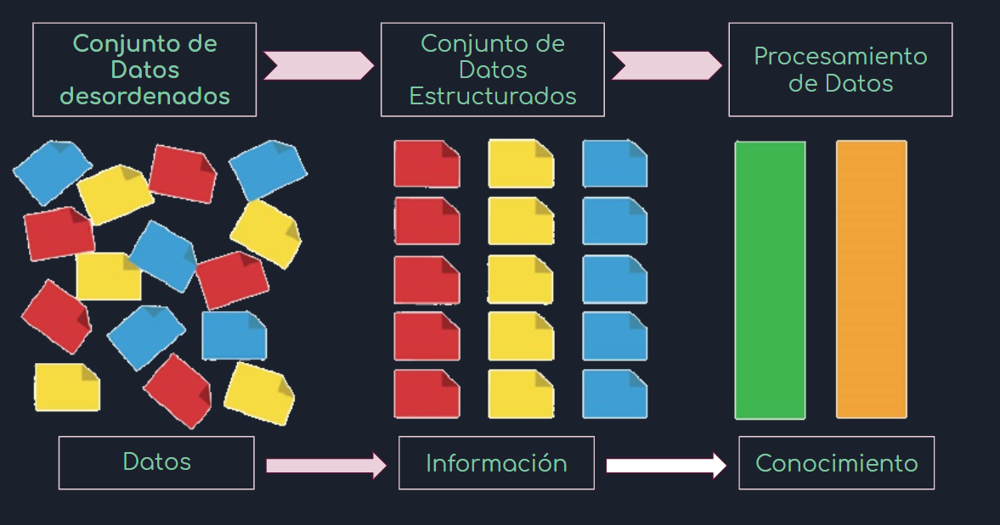

<style>
body {
text-align: justify}
}
</style>

# Datos
## ¿Qué son los datos?

* [Wikipedia](https://es.wikipedia.org/wiki/Dato). Un dato es una representación simbólica (numérica, alfabética, algorítmica, espacial, etc.) de un atributo o variable cuantitativa o cualitativa. 

* [Real Academia Española](https://dle.rae.es/dato). Del latín datum *'lo que se da'*

  -Información sobre algo concreto que permite su conocimiento exacto o sirve para deducir las consecuencias derivadas de un hecho.

  -Documento, testimonio, fundamento.

  -Informática. Información dispuesta de manera adecuada para su tratamiento por una computadora. 


## ¿Qué son las bases de datos?

* [Wikipedia](https://es.wikipedia.org/wiki/Base_de_datos). Una base de datos es un conjunto de datos pertenecientes a un mismo contexto y almacenados sistemáticamente para su posterior uso.

* [Platzi](http://www.maestrosdelweb.com/que-son-las-bases-de-datos/). Una base de datos es un “almacén” que nos permite guardar grandes cantidades de información de forma organizada para que luego podamos encontrar y utilizar fácilmente.

## Transformación de Datos



## Tipos de Bases de Datos

Existen diferentes tipos de bases de datos

* Estructuradas
* No Estructuradas

También existen diferentes tipos de formatos de bases de datos

* csv
* xlsx
* xml
* sql
* HDF
* NetCDF
* json
* dta
* sav
* jpeg
* png
* svg
* GML
* GPX
* GIS
* GeoJson

# Proyectos 

Para cualquier proyecto los pasos a seguir son:

* Objetivos
* Marco Teórico
* Recolección de información (encuestas, datos de internet, censos, etc.)
* **Estructuración de los datos**
* Análisis de datos/información
* Conclusiones/Recomendaciones
* Toma de decisiones

# Data Frames en R

Una de las estructuras más conocidas de R es el data frame (marco de datos), esta estructura permite representar la información de forma tabular, donde cada fila es una obsevación y cada columna es una variable.

## Paquete dplyr

Este taller se enfocará en el uso de la paquete `dplyr` de R, que fué desarrollado por Hadley Wickham y Romain Francois, como una optimización del paquete `plyr`. 

Este paquete ofrece diferentes bondades en el manejo y administración de data frames en R, ya que simplifica muchas cosas desde la facilidad del código, una mejor funcionalidad y es mucho más rápido en su procesamiento, porque muchas de las operaciones están codificadas en C ++.

Las funciones principales del paquete son:

* `filter`: extrae/filtra un subconjunto de filas de un data frame basado en una condición lógica.
* `select`: retorna un subconjunto de columnas de un data frame.
* `group_by`: agrupa los datos en el data frame de acuerdo a las variables.
* `summarise`/`summarize`: genera estadísticas resumidas de diferentes variables.
* `arrange`: ordena las filas de un data frame en función de los valores de una o más columnas.
* `rename`: renombra variables en un data frame.
* `mutate`: añade nuevas variables/columnas o las transforma.
* `pipe %>%`: es un operador utilizado para conectar funciones. 


## Práctica con dplyr

Ejemplo.

Se quiere sacar los porcentajes de votación de los partidos políticos por cada departamento, a partir de la base de datos publicada por el Organo Eletoral Plurinacional (OEP) en su página web del [cómputo oficial](https://computo.oep.org.bo/).

Solución.

Se carga el paquete 

```{r}
#install.packages("dplyr")
library(dplyr)
```
Se llama a los datos:

```{r}
bd<-read.csv("./BD/elecciones_2020_mundo.csv")
```

```{r}
class(bd)
```

```{r}
head(bd,n=1433)
```

```{r}
tail(bd,n=30)
```

```{r}
str(bd)
```

```{r}
levels(factor(bd$CANDIDATURA))
```
### filter 

`filter`: extrae/filtra un subconjunto de filas de un data frame basado en una condición lógica.

```{r}
bd_pres<-filter(bd,CANDIDATURA=="PRESIDENTE")
```


```{r}
head(bd_pres,n=10)
```

```{r}
levels(factor(bd_pres$CANDIDATURA))
```

### select

`select`: retorna un subconjunto de columnas de un data frame.

```{r}
str(bd_pres)
```

```{r}
bd_pres_pais<-select(bd_pres,CANDIDATURA,PAIS)
table(bd_pres_pais)
```
```{r}
bd_pres_dep<-filter(bd_pres,PAIS=="Bolivia")
head(bd_pres_dep)
```

```{r}
names(bd_pres_dep)
```

```{r}
bd_pres_dep<-select(bd_pres_dep,CANDIDATURA,PAIS,DEPARTAMENTO,INSCRITOS_HABILITADOS:VOTO_EMITIDO_SISTEMA)
head(bd_pres_dep)
```

```{r}
names(bd_pres_dep)
```

### group_by

`group_by`: agrupa los datos en el data frame de acuerdo a las variables.


```{r}
bd_pres_dep_g<-group_by(bd_pres_dep,DEPARTAMENTO)
head(bd_pres_dep_g)
```

```{r}
names(bd_pres_dep_g)
```

```{r}
str(bd_pres_dep_g)
```

```{r}
class(bd_pres_dep_g)
```


### summarise

`summarise`/`summarize`: genera estadísticas resumidas de diferentes variables.

```{r}
bd_pres_dep_gs<-summarise(bd_pres_dep_g,habilitados=sum(INSCRITOS_HABILITADOS),
                         creemos=sum(CREEMOS),
                         adn=sum(ADN),
                         mas=sum(MAS_IPSP),
                         fpv=sum(FPV),
                         pan_bol=sum(PAN_BOL),
                         libre21=sum(LIBRE_21),
                         cc=sum(CC),
                         juntos=sum(JUNTOS),
                         validos=sum(VOTO_VALIDO),
                         blancos=sum(VOTO_BLANCO),
                         nulos=sum(VOTO_NULO),
                         emitidos=sum(VOTO_EMITIDO),
                         conteo=n())
```

```{r}
head(bd_pres_dep_gs,10)
```

### mutate

`mutate`: añade nuevas variables/columnas o las transforma.

```{r}
bd_pres_dep_gs_porc<-mutate(bd_pres_dep_gs,
                            p_creemos=(creemos/validos)*100,
                            p_adn=(adn/validos)*100,
                            p_mas=(mas/validos)*100,
                            p_fpv=(fpv/validos)*100,
                            p_pan_bol=(pan_bol/validos)*100,
                            p_libre21=(libre21/validos)*100,
                            p_cc=(cc/validos)*100,
                            p_juntos=(juntos/validos)*100)
```

```{r}
head(bd_pres_dep_gs_porc,10)
```


### rename

`rename`: renombra variables en un data frame.

```{r}
bd_final<-select(bd_pres_dep_gs_porc,DEPARTAMENTO,p_creemos:p_juntos)

```
```{r}
bd_final<-rename(bd_final,departamento=DEPARTAMENTO)
```

```{r}
head(bd_final,10)
```

### arrange

`arrange`: ordena las filas de un data frame en función de los valores de una o más columnas.


```{r}
bd_final<-arrange(bd_final,p_creemos)
bd_final
```

```{r}
bd_final<-arrange(bd_final,desc(p_creemos))
bd_final
```

```{r}
bd_final<-arrange(bd_final,desc(p_mas,p_cc,p_creemos,))
bd_final
```


### Operador "pipe"

`pipe %>%`: es un operador utilizado para conectar funciones. 

```{r}
#rm(list=ls())

#bd<-read.csv("./BD/elecciones_2020_mundo.csv",quote = "\t") 

```

# Referencias

* [Rubén Sanchez Sancho - Programación en R](https://rsanchezs.gitbooks.io/rprogramming/content/chapter9/select.html)

* 